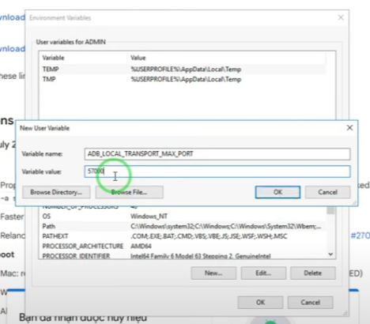

# adb unblock max devices

Vào Start > gõ Envir > Enter > click Envir... Var... > Trong box trên "user var..." > chọn "New..."

Var... name > ADB_LOCAL_TRANSPORT_MAX_PORT

Var... value > 77889

click ok all

vậy là xong, mở được 77889 port devices

kết nối phone / máy ảo android thoải mái

xem file: adb-unblock-max-devices.PNG

