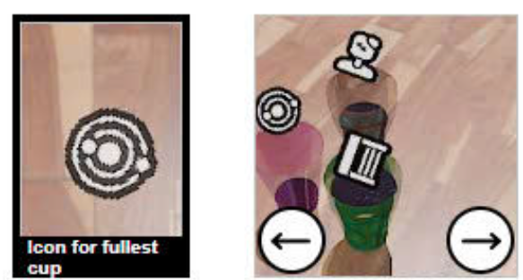
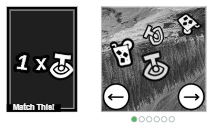
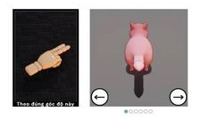
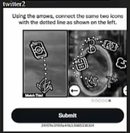
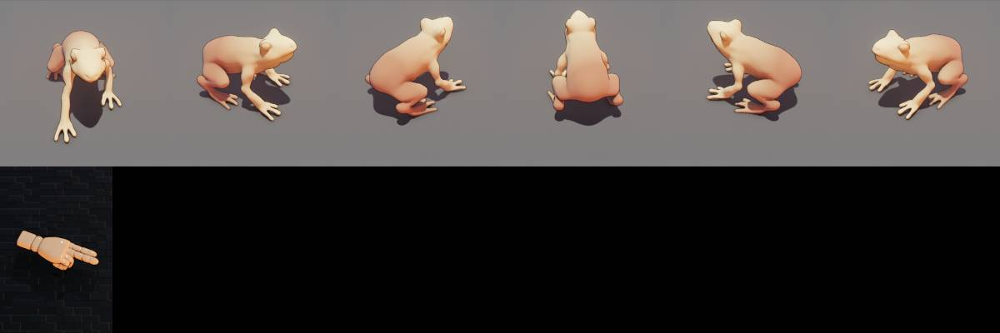
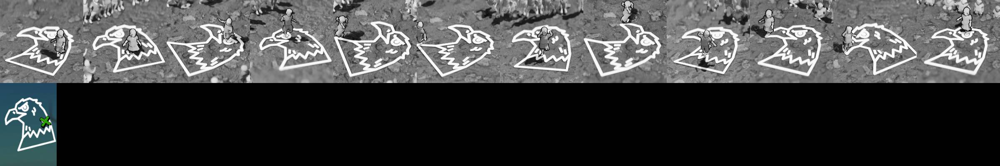
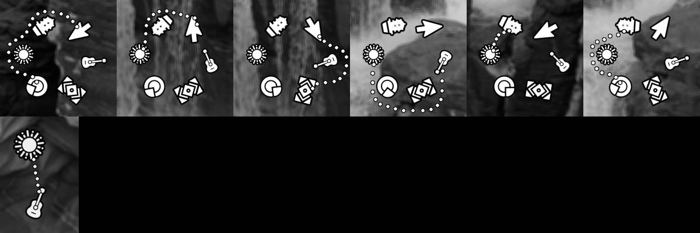
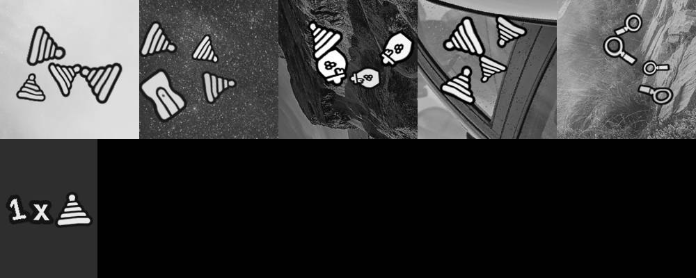
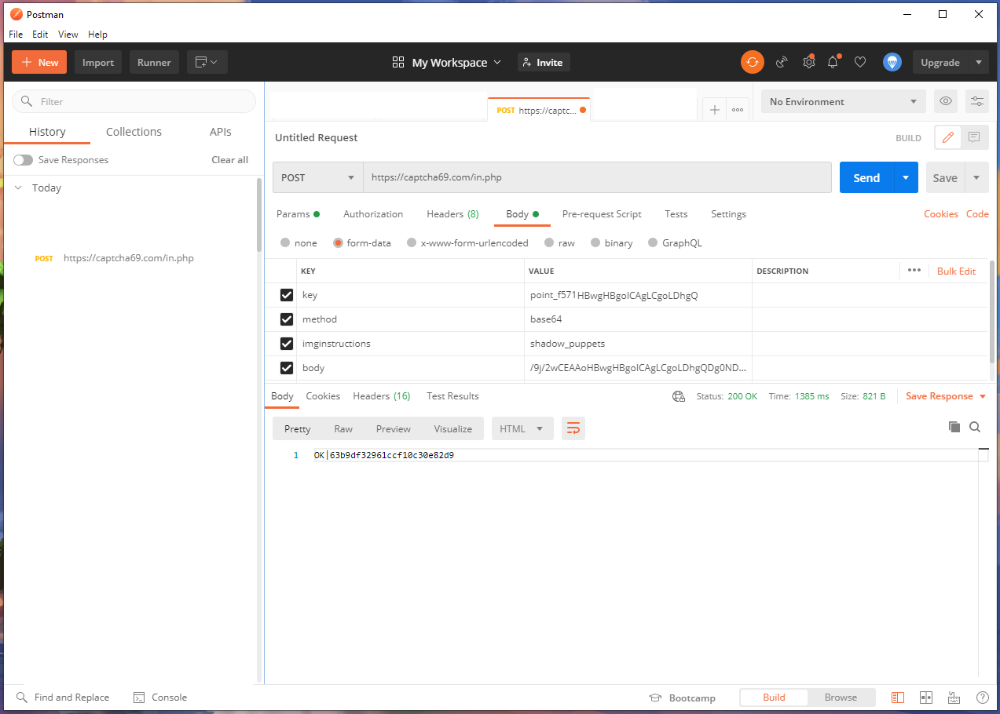

&imginstructions=watericoncup
<br><br>


&imginstructions=mask_match
<br><br>


&imginstructions=finger_direction
<br><br>


&imginstructions=icon_connect
<br><br>

#Danh Sách Câu Hỏi ( imginstructions )

Xem Tại Đây > https://github.com/nttrung9x/code-linh-tinh/blob/main/imginstructions-03-2025.cs

<br> Cách GET URL và Chuyển Về Base64:
<br> 1. Bạn vào trang hiển thị captcha, click Authen hoặc Next cho nó hiện ra câu hỏi và captcha
<br> 2. Chuột phải vào tấm ảnh đó và chọn "inspect" để hiện ra tab developer debug
<br> 3. Trong tab "Elements" bạn sẽ thấy line debug trong khu vực "iframe"
<br> 4. Bạn nhìn dòng đó hoặc dò lên hoặc dò xuống vài dòng, sẽ thấy element "img" có "backgound-img" có chứa nội dung kiểu "blob:https://xxx",
<br> >>> Ví dụ:
```

```
<br> 	
<br> 
<br> 5. Copy nguyên URL đó, bao gồm cả "blob:", ta có: blob:https://client-api.arkoselabs.com/32dc3326-13bb-48a0-858d-f312bafd2329
<br> 6. Bạn mở thử URL đó trong tab mới của chrome, nếu thấy nó hiện ra ảnh dạng cells tương tự như ở dưới thì có nghĩa là đã GET đúng
<br> 7. Bây giờ bạn chuyển nó về Base64 Là xong
<br> 8. Đoạn code JavaScript Mẫu để chuyển link Blob về Base64:

```
		const getBase64FromUrl = async (url) => {
		  const data = await fetch(url);
		  const blob = await data.blob();
		  return new Promise((resolve) => {
			const reader = new FileReader();
			reader.readAsDataURL(blob); 
			reader.onloadend = () => {
			  const base64data = reader.result;   
			  resolve(base64data);
			}
		  });
		}

	var Base64Code = await getBase64FromUrl("blob:https://client-api.arkoselabs.com/32dc3326-13bb-48a0-858d-f312bafd2329").then(function(base64data) 
	{
		return base64data.split(";base64,")[1];
	});
```
<br> 	
<br> 
<br> Bạn Phải Get Ra Ảnh Như Này Rồi Chuyển Về Base64 Nha:
<br> finger_direction


 
<br> hopscotch



<br> icon_connect



<br> mask_match



# Hướng Dẫn Sử Dụng
API: https://xxx/in.php

Method Code: POST

+ Parameter:

&body: send your captcha image content with Base64 Encode

&key: point_6f65468fb46ed730882c1e7b866042fc

&method: base64

&imginstructions: câu hỏi đã lọc ( phần màu xanh phía trên )

&json: 0

Demo: POST: https://captcha69.com/in.php?json=0&key=point_6f65468fb46ed730882c1e7b866042fc&method=base64&imginstructions=shadow_puppets&body=/9j/2wCEAA...

Sau khi request sẽ nhận về text  OK|63b9df32961ccf10c30e82d9 

63b9df32961ccf10c30e82d9 là id và sẽ thay đổi mỗi lần request

Thay đổi id 63b9df32961ccf10c30e82d9 cho đúng id mà bạn nhận được khi request lên /in.php

Demo: GET / POST: https://captcha69.com/res.php?key=point_6f65468fb46ed730882c1e7b866042fc&action=get&id=63b9df32961ccf10c30e82d9

Sau khi request lên res.php ta sẽ nhận về kết quả của captcha image  OK|ket_qua 

Ví dụ kết quả là OK|3

Số 3 chính là vị trí ảnh cần click trong Grid image như ví dụ bên trên

Lấy Nhanh Code Base64 Images Để Test Code trong Postman: https://captcha69.com/test-api-img.php

Nhớ xóa phần này => data:image/jpeg;base64,

Json Postman demo: https://xxx/postman/postman-funcaptcha-captcha69.zip



<br> 
<br> 
<br> 
<br> 
<br> 
<br> 
<br> 
<br> 
<br> 
<br> 
<br> 
<br> 
<br> 
<br> 
<br> 
<br> 
<br> 
<br> 
<br> 
<br> 
<br> 
<br> 
<br> 
<br> 
<br> 
<br> 
<br> 
<br> 
<br> 
<br> 
<br> 
<br> 
<br> 
<br> 
<br> 
<br> 
<br> 
<br> 
<br> 
<br> 
<br> 
<br> 
<br> 
<br> 
<br> 
<br> 
<br> 
<br> 
<br> 
<br> 
